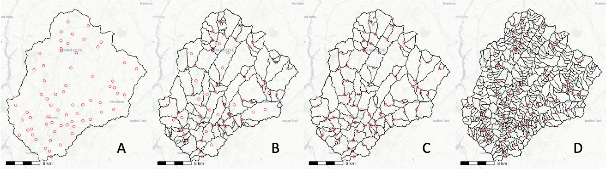

# NGEN HY\_Features-based data scheme

The readme below describes the data model used for the NGEN framework. The terminology here is rooted in the [HY\_Features data standard](https://docs.opengeospatial.org/is/14-111r6/14-111r6.html). 

The sections that follow describe the fundamentals of the NGEN data model. Definitions that are important to the data model are included at the bottom.

## Reference Domain and Model Domain

NGEN intends to support systems of model instances that represent hydrology across a regional to national domains. To accomplish this, the framework uses two domains: a reference domain shared by all model instances and *1..n* model domains that coincide with the reference domain in a number of ways. A model domain can be as small as a few square kilometers or as large as an entire drainage basin. Within a model domain, any discretization or formulation can be used as long as forcings, waterbody fluxes, and land-surface states can be exchanged with the framework according to the reference domain hydrologic locations and/or supported spatial coupling coverages.



A. A model domain may implement a continuous or gridded discretization that can exchange information with the reference domain through hydrologic locations and spatial couplings but does not use a catchment-based discretization within the framework. A mapping configuration for hydrologic locations and spatial couplings is required in this case.

B. A model domain may implement a catchment-based discretization that does not perfectly coincide with the reference domain catchments. Framework catchment functionality could be used with model-domain-specific catchment identifiers and hydrologic location and spatial couplings could also be used.

C. A model domain may implement a catchment-based discretization that coincides with the reference domain catchments. In this case, no mappings are required for hydrologic locations or spatial couplings. Note that such a discretization may be courser than the reference domain catchment network such that all catchments are catchment aggregates made up of reference domain catchments.

D. A model domain may implement a catchment-based discretization that is at a finer resolution than the reference domain. Framework catchment functionality can be used in this case. Similar to the continuous or gridded discretization, a mapping configuration for hydrologic locations and spatial couplings is required in this case.

## Hydrologic and Hydrodynamic Graphs:


[See hygeo for more about the data model.](https://dblodgett-usgs.github.io/hygeo/dev/)

## Model Domain Parameters
Case 1: Lumped model at reference discretization or coarser:

For a given model domain, a parameter configuration file declares an inflow nexus, outflow nexus, default parameters, and formulation. A list of catchment area parameter objects corresponding to the model domain formulations used must be included. The parameter objects can be empty if default parameters are to be used. A catchment ID is required for all catchments in the model domain. 

Case 2: Lumped model discretized at a finer resolution than reference domain or non-catchment discretization:  
For a model domain that encompasses multiple reference domain catchments, mappings from model i/o hydrologic locations to reference domain i/o hydrologic locations are provided in a separate file. Other model domain to reference domain mappings may be required.

### Core Schema

<details><summary>Example Instance</summary>
<p>
  
```json
{
  "model-domain-id": {
    "inflow-hydroNexus": "reference-nexus-id",
    "outflow-hydroNexus": "reference-nexus-id",
    "defaults": {
      "formulation": "formulation-id",
      "parameters": {
        "formulation-1": {
          "param1": 123,
          "param2": 123
        },
        "formulation-2": {
          "param1": 123,
          "param2": 123
        }
      },
      "forcings": "default-forcings"
    },
    "catchments": {
      "catchment-id": {
        "formulation-1": {
          "param1": 123,
          "param2": 123
        }, 
        "forcings": "custom-forcings"
      },
      "catchment-id": {
        "formulation-2": {
          "param1": 123,
          "param2": 123
        }
      }
    }
  }
}
```

</p>
</details>

## Definitions

### model domain: A subset of the reference domain. 

- Specified as a catchment aggregate using an inflow nexus and outflow nexus. 
- A model domain uses a consistent catchment area formulation for all contained catchments. 
- A model domain is a catchment network with internal i/o hydrologic locations that link to reference domain i/o hydrologic locations. 

### reference domain: A continental-scale hydrofabric

- A common hydrography catchment / nexus network for i/o locations and forcing / coupling interface standardization.

### catchment: see [HY\_Features](https://docs.opengeospatial.org/is/14-111r6/14-111r6.html#_catchment)

### catchment aggregate: [see HY\_Features](https://docs.opengeospatial.org/is/14-111r6/14-111r6.html#_catchment_aggregate)

- In this context, an aggregate of reference domain catchments

### inflow nexus: [see HY\_Features](https://docs.opengeospatial.org/is/14-111r6/14-111r6.html#figure25)

### outflow nexus: [see HY\_Features](https://docs.opengeospatial.org/is/14-111r6/14-111r6.html#figure25)

### catchment network: [see HY\_Features](https://docs.opengeospatial.org/is/14-111r6/14-111r6.html#_catchment_network_topology)

### hydrologic location: [see HY\_Features](https://docs.opengeospatial.org/is/14-111r6/14-111r6.html#_hydro_logic_location)


