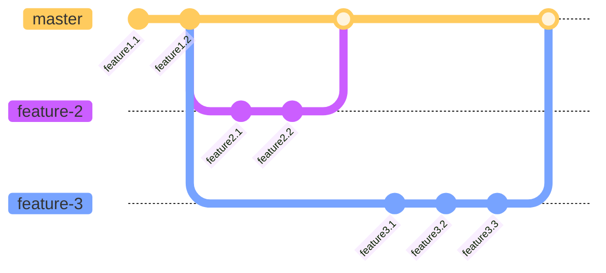
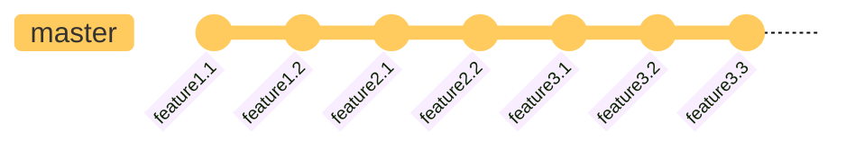
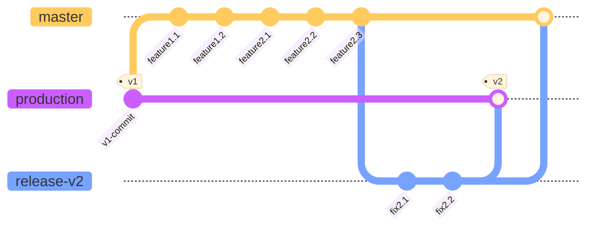
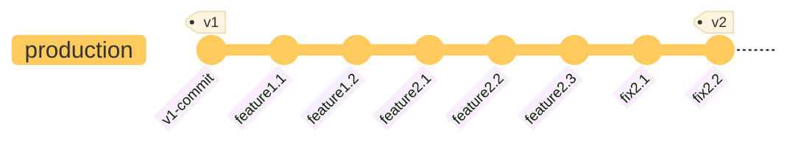
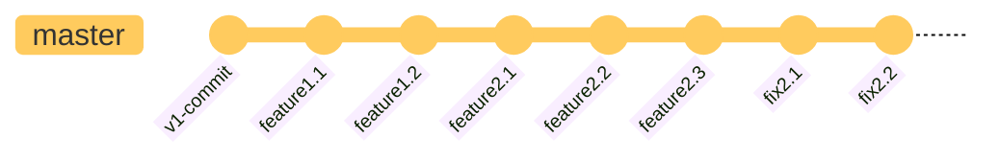

# Git Strategy

Note that this document goes into detail on the Git strategy and branching model for the official OWP repository.  It is here for openness and transparency, but most contributors and users will not need to be concerned with this level of detail.  For information geared toward day-to-day development contributions and Git, see the [CONTRIBUTING](../CONTRIBUTING.md) doc.

- [Branching Model](#branching-model)
  - [Feature Branches from `master`](#feature-branches-from-master)
  - [Relating `production`, `master`, and Release Branches](#relating-production-master-and-release-branches)
- [Contributing](#contributing)
- [Optional: Setting Up Hook Scripts](#optional-setting-up-hook-scripts)

## Branching Model

- This repo uses a branching model based on [Gitflow](https://nvie.com/posts/a-successful-git-branching-model/) that has two primary long-term branches:
  - **master**: the main development and integration branch containing the latest completed development work intended for the next released version
  - **production**: the branch representing the latest code verified as production-ready and pointing to the most recently release, official version
- Rebasing is used to integrate changes across branches, rather than merge commits
  - This allows the repo to maintain a more robust and complete history
- Most interaction with the official OWP repo is done via pull requests (PRs) to the `master` branch
  - Independent branches for features or bug fixes are created off `master` to contain development work that is in progress
  - Once work in a feature/fix branch is complete (or at least thought complete), it is used to create a PR
  - PRs and their linked branches are reviewed and, once approved, have their changes integrated back into `master`
  - Typically feature/fix branches exist in personal clones and personal Github forks, but not in the official OWP repo
- Release branches (e.g., `release-X` for pending version `X`) will be created whenever it is time to officially release a new version
  - These effectively are release candidates, with branches created from `master`
  - The release branches are managed by the core OWP contributors team
  - They do exist in the official OWP repo
  - But they are short-lived and removed once the release becomes official
  - See the [Release Management](RELEASE_MANAGEMENT.md) doc for more details on the release process

### Feature Branches from `master`
This illustrates the relationship between feature branches and `master`.  They should be created from `master` and independently contain commits from their feature.  Once done, the changes will be reintegrated back into `master` via rebasing.

The resulting state of `master` after rebasing the two new feature branches would be:

### Relating `production`, `master`, and Release Branches

This illustrates the relationship between `production`, `master`, and `release-v2`.  Notice that `production` has already been tagged with version `v1` at the start.  Commits for `feature1` and `feature2` at some point are integrated into `master`.  When it is time to prepare to release version `v2`, `release-v2` is created.  A few bug fix commits were needed in `release-v2`.  After that, all the changes in `release-v2` are integrated into `production`, and `production` is tagged `v2`.  All the changes are also integrated back into `master`.

The resulting state of `production` is:

The resulting state of `master` is essentially the same:

## Contributing

More details on the practical processes and requirements for contributing code changes can be found in the [CONTRIBUTING](../CONTRIBUTING.md) doc.  In summary:

- Github Pull Requests (PRs) are required to incorporate changes into the official OWP repo
  - Contributors should generally not be pushing changes directly to branches in the OWP repo
- PRs should be submitted using a feature/fix branch contained in a personal Github fork
- Rebasing is used, rather than merge commits, to integrate changes across branches and keep branches from different repos in sync
- PRs should be configured to pull changes into the `master` branch
- Feature/fix branches should be created from `master`
- Personal forks and local clone(s) should be kept up to date with the official OWP repo regularly to minimize the introduction of merge conflict in PRs

## Optional: Setting Up Hook Scripts

_Git_ supports the capability to automatically run various scripts when certain events happen.  These are referred to as [_Git_ hooks](https://git-scm.com/book/en/v2/Customizing-Git-Git-Hooks).  See Git's documentation for full details on what can be done with hooks and how they are configured.  

Use of client-side hooks is optional but can be very useful for things like automating some kind of quality check before committing a change.  However, client-side hooks are not copied as part of cloning a repository.  They must be set up locally for each clone.  This can be done manually or using available helper tools:  e.g., [_pre-commit_](https://pre-commit.com/).  Once again, see Git's docs for available options and setup details.