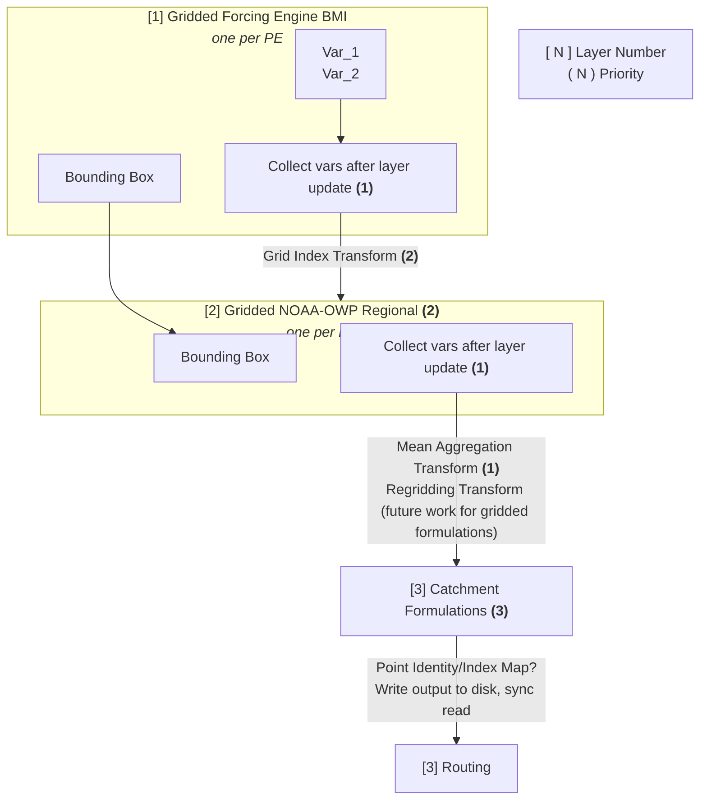

# Initial spatial coupling design

## Terms

The following are some terms used to disscuss the spatial intefrace and layer semantics.  These are just loose, conceptual terms at the moment, and are subject to refinement, removal, ect.  They are, for now, simply useful to think about and design with.

**Catchment**: Computational response unit of the framework, with 2D geometry (polygon) and unique identity provided by HY Features Hydrofabric.  

**Spatial Source**: A geo-spatial data set (e.g. grid) that must provide inputs to a **Catchment**.

**Spatial Catchment**: Spatially discritized **Catchment** with a clear definition of the discritization/grid type (See [BMI grid types](https://bmi.readthedocs.io/en/stable/index.html#get-grid-type))

## Use Case Diagram
A basic use case required to be supported by the spatial coupling semantics is diagrammed below.  A more complete description of this diagram will be added to this document.

## Initial Simplifying Assumpitons
- Start with a uniform rectilinear input grid
- Ensure NOAH-OWP Regional layer aligns with this grid (no regridding required)
- Preprocess catchment -> grid intersections/weight maps
    - Use these for quick mean aggregation of variables to lumped catchment

## Features required
- Need a spatially aware catchment/formulation mechanic which can 
    - Store spatial meta data
        - Grid Type, Weight Maps, Ect
    - Virtually dispatch data to BMI models using `Set_Value()`, with required spatail transforms (aggregation, regridding, ect) handled in the dispatch

